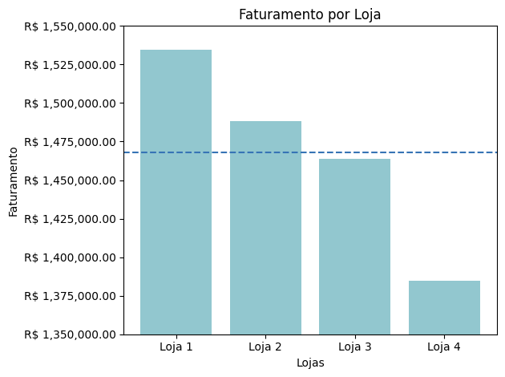
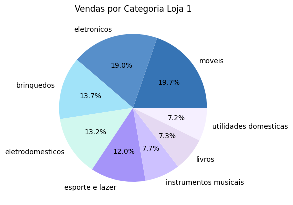
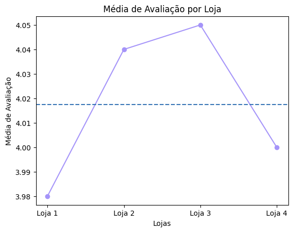
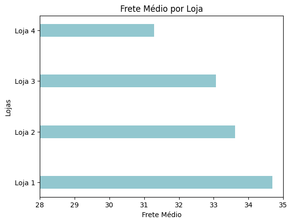

# 📊Desafio Alura Store

## 📃Sobre o Desafio
O desafio consiste em fazer uma análise dos dados de quatro lojas do Seu João, ajudando-o a decidir qual delas ele irá vender para começar um novo empreendimento. 

## 🎯Objetivo
O objetivo é identificar a loja com menor eficiência e apresentar uma resomendação baseada nos dados e gráficos. As competências colocadas em prática são:
- Carregar e manipular dados CSV com a biblioteca Pandas,
- Criar visualizações de dados com biblioteca Matplotlib,
- Analisar métricas como faturamento, avaliações e desempenho de vendas.
- 
## ❗Requisitos do Desafio
- Analisar os dados das lojas: avaliando informações como faturamento, categorias mais vendidas, avaliações dos clientes, produtos mais vendidos e frete médio.
- Crias gráficos: com finalidade de visualização e análise dos dados. O desafio pede a criação de pelo menos três gráficos diferentes.
- Apresentar uma recomendação: com base nos dados analisados escrever um texto apresentando qual loja tem menor desempenho e portanto deve ser a escolhida para a venda.
- 
## 📉Gráficos e Insights

- Gráfico de barras horizontais que permite a visualização do faturamento total de cada loja e sua performance baseada na média de faturamento.

- Gráfico de pizza que permite a visualização de vendas por categoria, podendo analisar quais categorias tem melhor e pior performance de vendas.

- Gráfico de plot que permite a visualização da média de avaliações de cada loja e sua performance baseada na média geral de avaliações.

- Gráfico de barras verticais que permitem a visualização do frete médio por loja.
- O código permite algumas visualizações para além dos gráficos como o total de vendas por categoria, as categorias com melhor e pior desempenho de vendas e os produtos mais e menos vendidos por loja.

## 🔨 Ferramentas Utilizadas
- **Google Collab**: para leitura do notebook.
- **Python**: para desenvolvimento do código do projeto.
- **Biblioteca Pandas**: para leitura e manipulação dos dados.
- **Biblioteca Matplotlib**: para geração de gráficos e visualizações.
